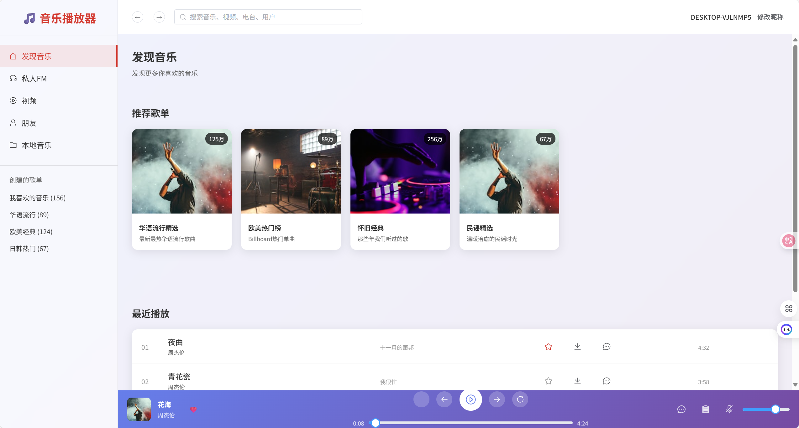

# 音乐播放器 Web 应用

一个基于 Vue 3 开发的现代化音乐播放器 Web 应用，提供流畅的音乐播放体验和丰富的功能。



## 功能特点

- 🎵 发现音乐：推荐歌单和最近播放列表
- 📻 私人FM：个性化音乐推荐
- 🎬 音乐视频：观看音乐相关视频
- 👥 社交功能：查看音乐好友动态
- 💾 本地音乐：管理本地音乐文件
- 🎧 播放控制：支持播放、暂停、上一首、下一首等功能
- 🔍 搜索功能：搜索音乐、视频、电台和用户
- 📱 响应式设计：支持各种设备屏幕尺寸

## 技术栈

- Vue 3：前端框架
- Vue Router：路由管理
- Vuex：状态管理
- Element Plus：UI 组件库
- APlayer：音频播放器
- Vite：构建工具

## 项目结构

```
src/
├── components/        # 组件目录
│   ├── Header.vue    # 顶部导航栏
│   ├── Sidebar.vue   # 侧边栏
│   ├── MusicPlayer.vue # 音乐播放器
│   └── ...
├── views/            # 页面目录
│   ├── HomeView.vue  # 主页
│   ├── DiscoverView.vue # 发现音乐
│   ├── LocalMusicView.vue # 本地音乐
│   └── ...
├── router/           # 路由配置
├── store/            # 状态管理
└── utils/            # 工具函数
```

## 运行项目

1. 克隆项目
```bash
git clone https://github.com/supermaodou/sharedMusicPlayer_web.git
cd sharedMusicPlayer_web
```

2. 安装依赖
```bash
npm install
```

3. 启动开发服务器
```bash
npm run dev
```

4. 构建生产版本
```bash
npm run build
```

## 浏览器支持

- Chrome
- Firefox
- Safari
- Edge

## 贡献指南

1. Fork 本仓库
2. 创建你的特性分支 (`git checkout -b feature/AmazingFeature`)
3. 提交你的更改 (`git commit -m 'Add some AmazingFeature'`)
4. 推送到分支 (`git push origin feature/AmazingFeature`)
5. 打开一个 Pull Request

## 许可证

[MIT License](LICENSE)
